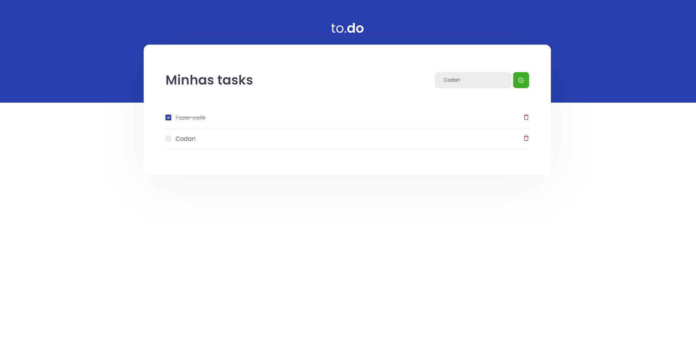

## 🎯 Sobre
<p>
  App controlar atividades
</p>

## :eyes: Layout


## :octocat: Execução da aplicação em desenvolvimento
- Requisítos: Instalar [Git](https://git-scm.com/), [Node](https://nodejs.org/en/), [Yarn](https://yarnpkg.com/)
- Baixar o repositório na máquina e entrar no projeto:
```bash
$ git clone https://github.com/FelipenKniess/ignite-appTask.git
$ cd ignite-appTask
```
- baixar as dependências do projeto e executar o projeto:
```bash
$ yarn
$ yarn dev
```
